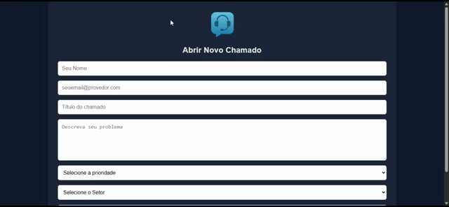
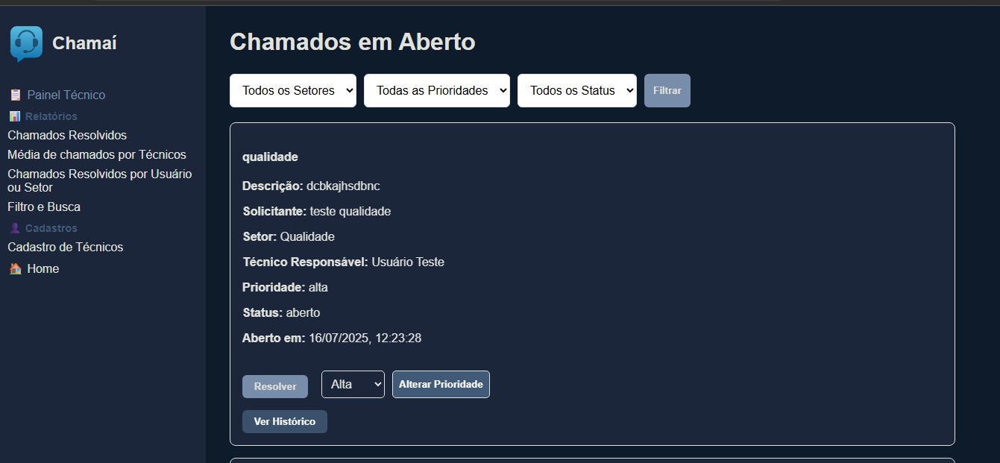

# 📞 Chamaí

**Chamaí** é uma plataforma completa para gerenciamento de chamados, desenvolvida para facilitar a comunicação entre usuários e técnicos, registrando e acompanhando o progresso dos chamados em tempo real.

---

## ✅ Funcionalidades

- **Criação de Chamados**: Usuários podem abrir chamados com título, descrição, prioridade e setor.
- **Cadastro de Técnicos**: Administradores podem cadastrar técnicos com login e senha próprios.
- **Atribuição de Técnicos**: Técnicos podem se atribuir aos chamados.
- **Alteração de Prioridade**: Técnicos podem alterar a prioridade dos chamados em aberto.
- **Resolução de Chamados**: Técnicos podem resolver chamados, e o sistema envia um e-mail automático ao solicitante.
- **Histórico de Ações**: Cada ação importante em um chamado é registrada e pode ser consultada.
- **Autenticação e Autorização**: Login com JWT e permissões diferentes para usuários, técnicos e administradores.
- **Painel Técnico**: Técnicos visualizam apenas os chamados em aberto e podem gerenciá-los.
- **Filtros e Busca**: Chamados podem ser filtrados por status, setor, prioridade e termo de busca.
- **Listagem de Setores**: O sistema identifica setores únicos automaticamente.
- **Recuperação de Senha**: Fluxo completo de recuperação e redefinição de senha via e-mail.
- **Exportação de Relatórios**: Exportação de chamados e relatórios em **PDF e XLSX (Excel)**.
- **Frontend com Vite**: O frontend do sistema foi desenvolvido com **React + Vite**, garantindo maior desempenho.

---

## 📸 Demonstração

### Tela de Abertura de Chamado



### Painel Técnico



---

## 🛠 Tecnologias Utilizadas

- **Backend**: Node.js com Express.js
- **Frontend**: React.js com **Vite**
- **Banco de Dados**: PostgreSQL
- **ORM**: Sequelize
- **Autenticação**: JWT (JSON Web Token)
- **Envio de E-mails**: API da Brevo (ex-Sendinblue)
- **Exportação de Relatórios**: `jsPDF` + `jspdf-autotable` + `xlsx`
- **Versionamento**: Git, GitHub

---

## ⚙️ Configuração

1. Clone o repositório:

   ```bash
   git clone https://github.com/Captain-not-so-obvious/Chamai.git
   cd Chamai
   ```

2. Instale as dependências:

   ```bash
   npm install
   ```

3. Configure o arquivo `.env`:

   ```env
   DB_HOST=localhost
   DB_NAME=chamai
   DB_USER=postgres
   DB_PASS=yourpassword
   DB_PORT=5432
   JWT_SECRET=your_jwt_secret
   BREVO_API_KEY=your_brevo_api_key
   SENDER_EMAIL=seu-email@provedor.com
   ```

---

## 🚀 Executando o Projeto

### Backend

```bash
npm install
npm start
```

- Servidor rodando em: `http://localhost:3000`

### Frontend

```bash
cd frontend
npm install
npm run dev
```

- Aplicação React com **Vite** rodando em: `http://localhost:5173`

---

## 🧪 Testes com Postman

### Criar chamado
```http
POST /chamados
```

```json
{
  "solicitanteNome": "João Silva",
  "solicitanteEmail": "joao.silva@example.com",
  "titulo": "Problema com login",
  "descricao": "Não consigo acessar minha conta.",
  "prioridade": "alta",
  "setor": "Financeiro"
}
```

### Login
```http
POST /usuarios/login
```

### Cadastrar técnico (via admin)
```http
POST /usuarios/tecnicos
Authorization: Bearer {token do admin}
```

---

## 📊 Exportação de Relatórios

O sistema já exporta relatórios em **PDF e XLSX (Excel)** diretamente do painel administrativo.

---

## 🤝 Contribuindo

Sinta-se à vontade para abrir **issues** ou enviar **pull requests** com correções, melhorias ou novas funcionalidades.

---

## 📄 Licença

Este projeto é de uso **livre e aberto**. Você pode modificá-lo e distribuí-lo conforme necessário.
